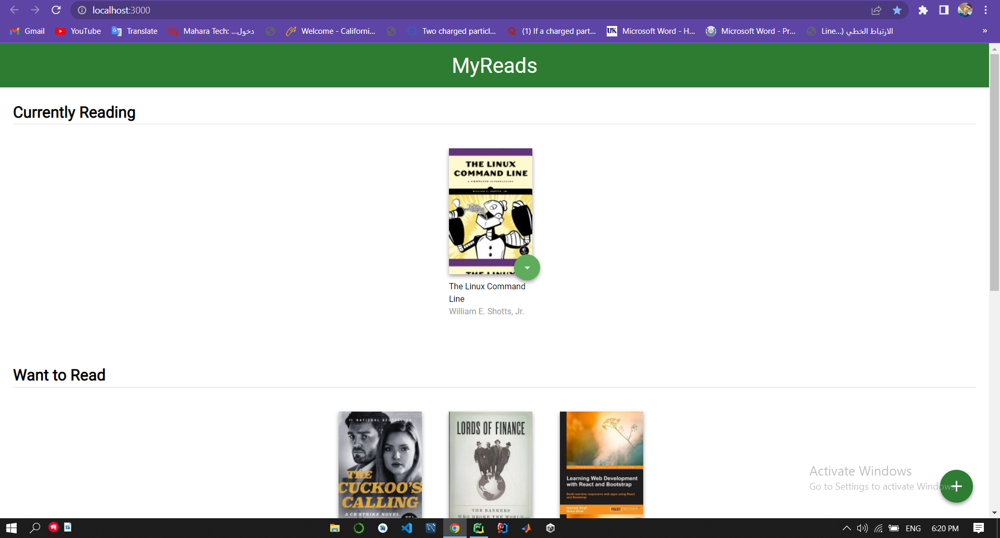
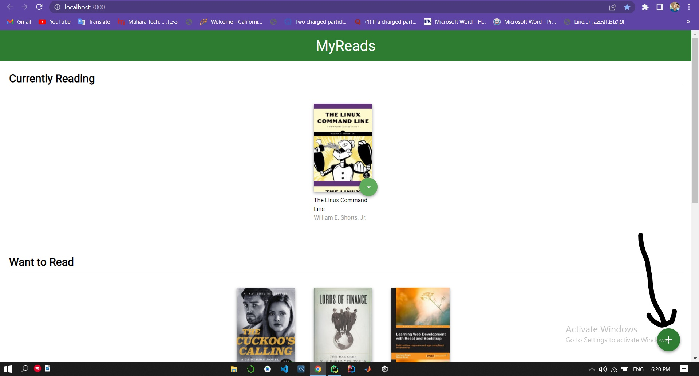
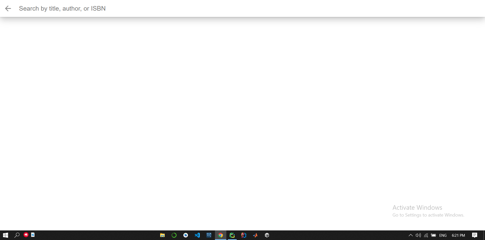
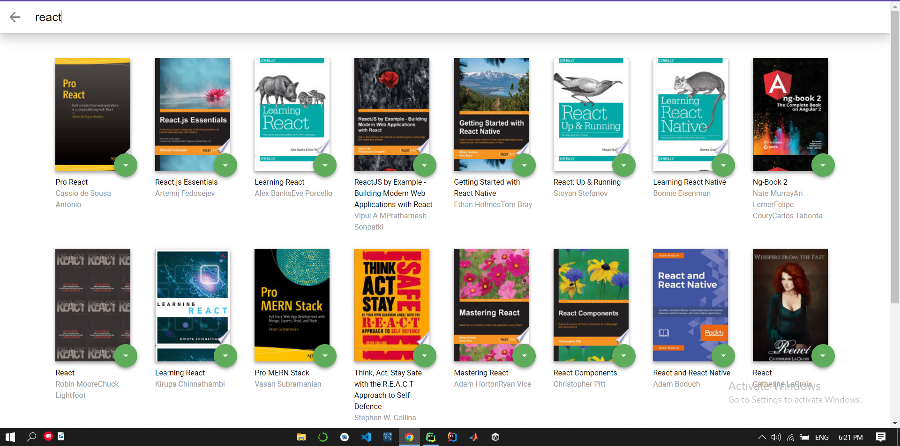
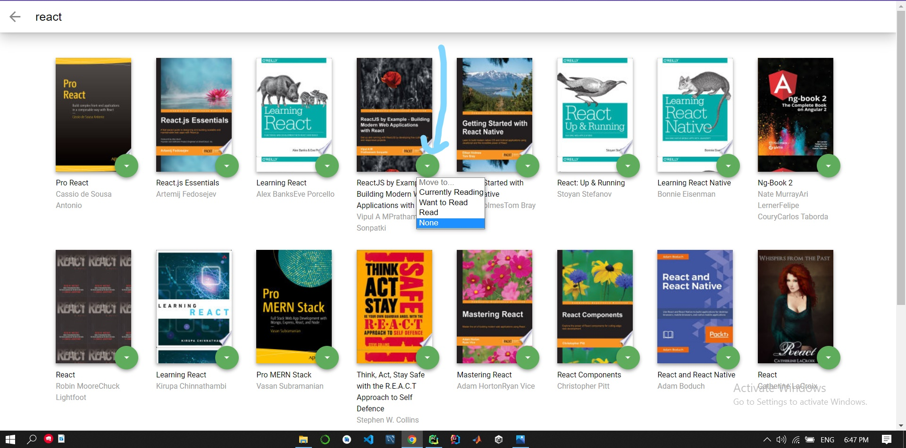
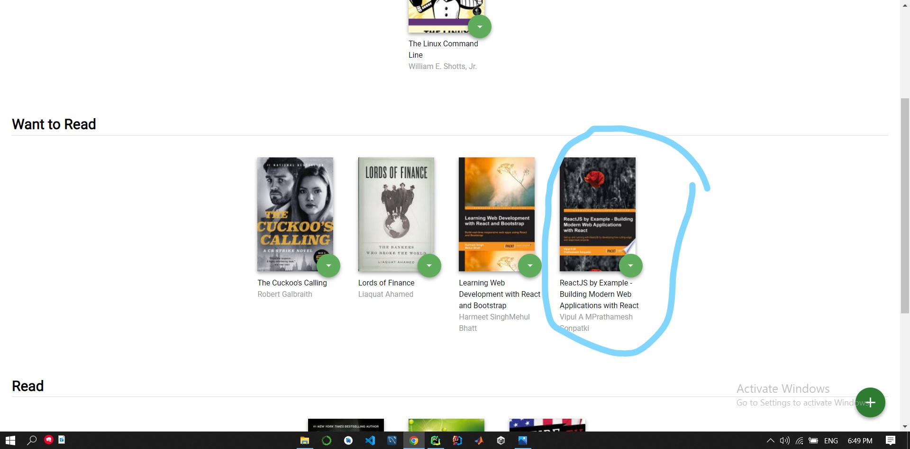

# MyReads Project

This Is Book Shelf Management App Using React  

## To Run App

To get Run The App With The Right Way:

- clone the project

## What You're Getting inside 'starter' file

```bash
├── README.md - This file.
├── package.json # npm package manager file. It's unlikely that you'll need to modify this.
├── public
│   ├── favicon.ico # React Icon, 
│   └── index.html # The Main Html
└── src
    ├── css
    │   ├── App.css # Styles for the app.
    │   └── index.css # Global styles. You probably won't need to change anything here.
    ├── utils
    │   └── BooksAPI.js # A JavaScript API for the provided Udacity backend. Instructions for the methods are below.
    ├── icons # images for the app. 
    │   ├── add.svg
    │   ├── arrow-back.svg
    │   └── arrow-drop-down.svg
    ├── componanants
    │   └── book
    │       └── BookCard.js # React Component To View Book Card (reusable component)
    ├── pages
    │   ├── bookshelf
    │   │   └── BookShelf.js # React Component To View Book Shelf Page (reusable component)
    │   └── shearch
    │       └── SearchPage.js # React Component To View Book Search Page (reusable component)
    └── index.js
```
# Then 
run this command to install all project dependencies
> npm install

then install prop-Types
> npm install prop-types
> 

start the development server with 
> npm start


# Now open "http://localhost:3000/" in the browser and Start Using The App 

You Should Find This Layout


To Navigate To Search Page

You Will Get


You Can Type Something To Search


You Can Change Shelf By Click on This Icon And Choose Shelf


After Select Shelf From Search Page Get Back TO Home Page You Will Find The Book In The Correct Shelf



# Used Technology's

- [React](https://reactjs.org/)